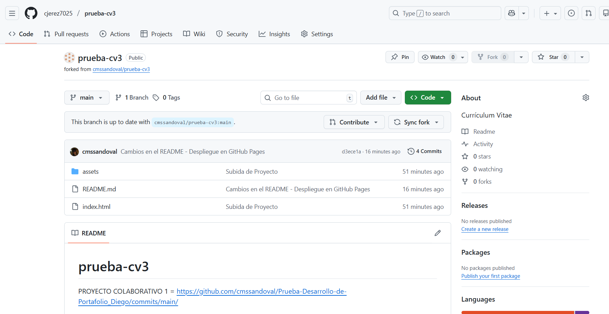
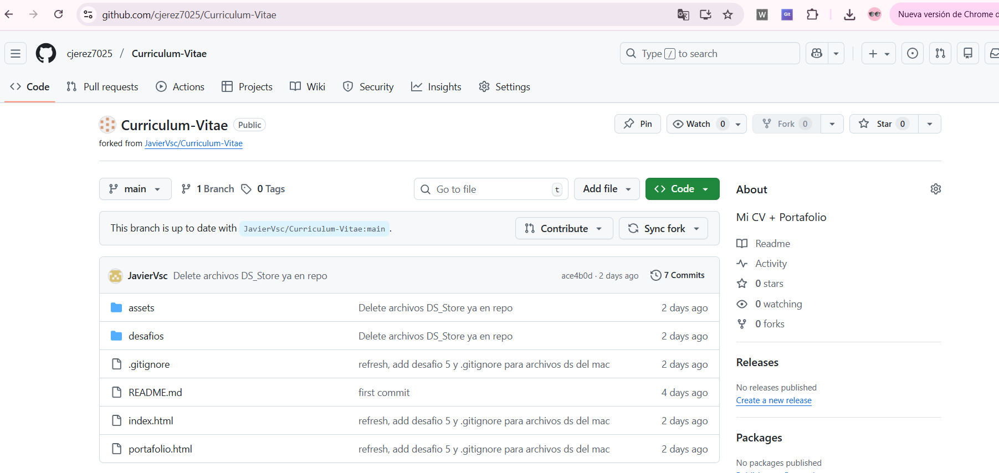
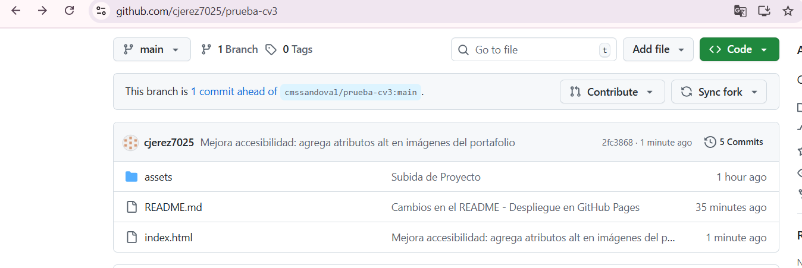
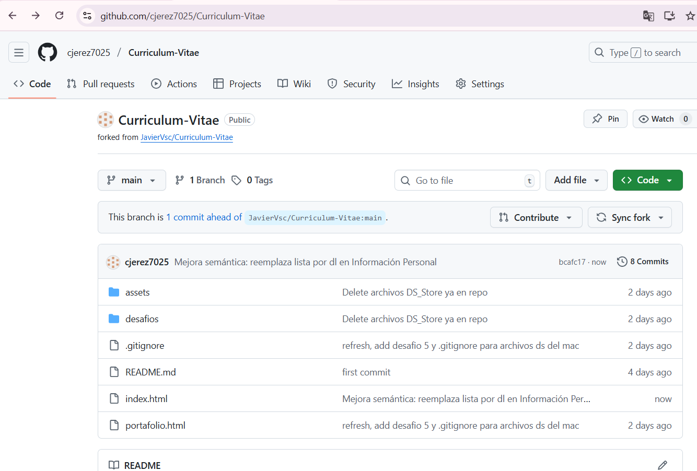
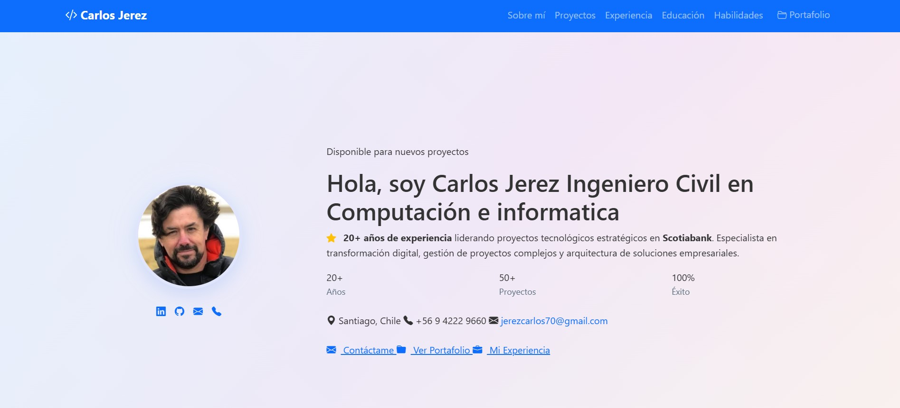
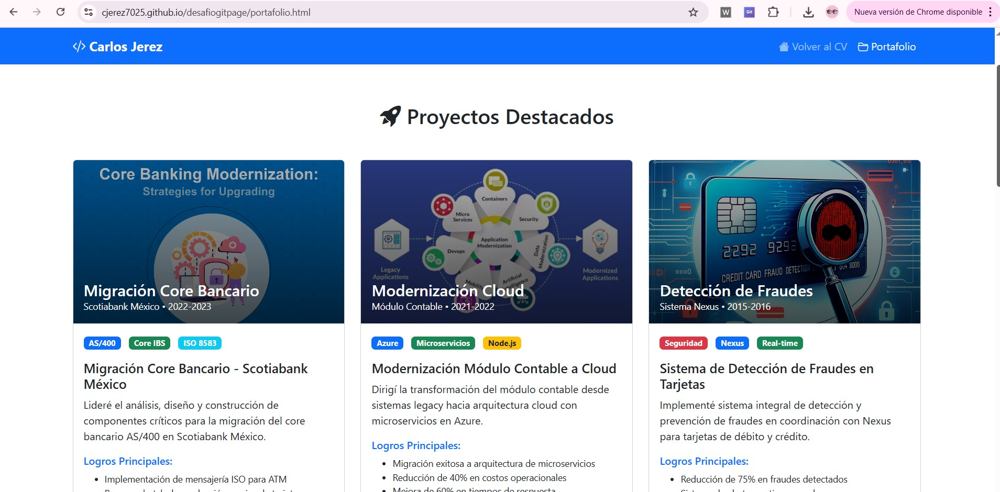

# 📋 Portafolio Personal - GitHub Pages

Proyecto de desarrollo de CV y Portafolio web desplegado en GitHub Pages, incluyendo trabajo colaborativo mediante forks y commits en repositorios de compañeros.

[](https://cjerez7025.github.io/desafiogitpage/)
[](https://developer.mozilla.org/es/docs/Web/HTML)
[](https://developer.mozilla.org/es/docs/Web/CSS)
[](https://getbootstrap.com/)

---

## 👤 Datos del Estudiante

| Campo | Información |
|-------|------------|
| **Nombre** | Carlos Alberto Jerez Barrientos |
| **Usuario GitHub** | [@cjerez7025](https://github.com/cjerez7025) |
| **Fecha de entrega** | 14/12/2025 |
| **Correo** | jerezcarlos70@gmail.com |

---

## 🔗 Enlaces Importantes

| Tipo | URL |
|------|-----|
| **Repositorio GitHub** | [github.com/cjerez7025/desafiogitpage](https://github.com/cjerez7025/desafiogitpage) |
| **Sitio Desplegado** | [cjerez7025.github.io/desafiogitpage](https://cjerez7025.github.io/desafiogitpage/) |

---

## 📝 Descripción del Proyecto

Este proyecto consiste en el desarrollo de un CV profesional y un portafolio web completo, implementando:

- ✅ Curriculum Vitae con HTML5 y CSS3
- ✅ Página de Portafolio con proyectos destacados
- ✅ Diseño responsive con Bootstrap
- ✅ Despliegue en GitHub Pages
- ✅ Trabajo colaborativo mediante Git y GitHub

---

## 🚀 Tecnologías Utilizadas

<div align="center">

| Tecnología | Uso |
|------------|-----|
|  | Estructura de contenido |
|  | Estilos y diseño visual |
|  | Framework CSS responsive |
|  | Control de versiones |
|  | Alojamiento y colaboración |
|  | Despliegue del sitio |

</div>

---

## ✅ Requisitos Completados (Puntos 1-3)

| # | Requisito | Estado | Puntos |
|---|-----------|--------|--------|
| 1️⃣ | CV con HTML y CSS | ✅ Completado | 2/2 |
| 2️⃣ | Página de Portafolio | ✅ Completado | 2/2 |
| 3️⃣ | GitHub Pages desplegado | ✅ Completado | 4/4 |

**Total Puntos (1-3):** 8/8 ✅

---

## 🔄 Punto 4: Fork de Proyectos (1 punto)

Se realizaron forks de repositorios de 2 compañeros para demostrar capacidades de trabajo colaborativo.

### 📌 Fork #1

| Campo | Información |
|-------|------------|
| **Compañero** | Carlos Sandoval |
| **Repositorio Original** | [github.com/cmssandoval/prueba-cv3](https://github.com/cmssandoval/prueba-cv3) |
| **Mi Fork** | [github.com/cjerez7025/prueba-cv3](https://github.com/cjerez7025/prueba-cv3) |
| **Fecha del Fork** | 12/12/2025 |

**Captura de Pantalla:**



---

### 📌 Fork #2

| Campo | Información |
|-------|------------|
| **Compañero** | Javier Ruz |
| **Repositorio Original** | [github.com/JavierVsc/Curriculum-Vitae](https://github.com/JavierVsc/Curriculum-Vitae) |
| **Mi Fork** | [github.com/cjerez7025/Curriculum-Vitae](https://github.com/cjerez7025/Curriculum-Vitae) |
| **Fecha del Fork** | 12/12/2025 |

**Captura de Pantalla:**



---

## 💻 Punto 5: Commits en Proyectos Forkeados (1 punto)

Se realizaron contribuciones significativas en cada repositorio forkeado mediante commits documentados.

### 🔨 Commit en Fork #1 (Carlos Sandoval)

| Campo | Detalle |
|-------|---------|
| **Repositorio** | [cjerez7025/prueba-cv3](https://github.com/cjerez7025/prueba-cv3) |
| **Archivo Modificado** | `index.html` |
| **Mensaje del Commit** | "Mejora accesibilidad: agrega atributos alt en imágenes del portafolio" |
| **Hash del Commit** | `2fc3868` |
| **Fecha y Hora** | 12/12/2025 |

**Descripción del cambio:**
- Agregados atributos `alt` en todas las imágenes del portafolio
- Mejora de accesibilidad web (WCAG)
- Optimización SEO de contenido visual

**Captura de Pantalla:**



---

### 🔨 Commit en Fork #2 (Javier Ruz)

| Campo | Detalle |
|-------|---------|
| **Repositorio** | [cjerez7025/Curriculum-Vitae](https://github.com/cjerez7025/Curriculum-Vitae) |
| **Archivo Modificado** | `index.html` |
| **Mensaje del Commit** | "Mejora semántica: reemplaza lista por dl en Información Personal" |
| **Hash del Commit** | `bcafc17` |
| **Fecha y Hora** | 12/12/2025 |

**Descripción del cambio:**
- Reemplazadas listas `<ul>` por listas de definición `<dl>` en datos personales
- Implementación de HTML semántico para estructura "campo: valor"
- Mejora de accesibilidad y SEO

**Captura de Pantalla:**



---

## 📊 Resumen Final de Puntos

| # | Requisito | Estado | Puntos Obtenidos |
|---|-----------|--------|------------------|
| 1 | CV con HTML/CSS | ✅ Completado | **2/2** |
| 2 | Página Portafolio | ✅ Completado | **2/2** |
| 3 | GitHub Pages | ✅ Completado | **4/4** |
| 4 | Fork de 2 proyectos | ✅ Completado | **1/1** |
| 5 | 1 commit por fork | ✅ Completado | **1/1** |

### 🎯 **PUNTAJE TOTAL: 10/10** ✅

---

## 📸 Capturas del Proyecto

### Vista Principal del CV



### Página de Portafolio



### GitHub Pages Desplegado


---

## 📁 Estructura del Proyecto

```
desafiogitpage/
│
├── index.html              # Página principal (CV)
├── portafolio.html         # Página de portafolio
├── css/
│   └── styles.css          # Estilos personalizados
├── asset/
│   ├── img/                # Imágenes y capturas
│   │   ├── fork-1.png
│   │   ├── fork-2.png
│   │   ├── commit-fork-1.png
│   │   ├── commit-fork-2.png
│   │   ├── captura-cv.png
│   │   └── captura-portafolio.png
│   └── (otros recursos)
├── README.md               # Este archivo

```


## 🤝 Trabajo Colaborativo

### Proceso de Fork y Contribución

#### Fork de Repositorio
```bash
# 1. Fork desde GitHub Web (botón Fork)
# 2. Clonar el fork
git clone https://github.com/cjerez7025/[repositorio-forkeado].git

# 3. Crear rama para cambios
git checkout -b mejoras-accesibilidad

# 4. Realizar cambios y commit
git add .
git commit -m "Mejora accesibilidad: agrega atributos alt"

# 5. Push al fork
git push origin mejoras-accesibilidad
```

## 📚 Características Implementadas

### CV (index.html)
- ✅ Información personal completa
- ✅ Sección de educación
- ✅ Experiencia profesional (Scotiabank - 20+ años)
- ✅ Habilidades técnicas
- ✅ Navegación funcional
- ✅ Diseño responsive
- ✅ Footer con enlaces

### Portafolio (portafolio.html)
- ✅ Galería de proyectos destacados
- ✅ Cards de Bootstrap con imágenes
- ✅ Descripción de cada proyecto
- ✅ Enlaces a repositorios
- ✅ Diseño en grid responsive
- ✅ Navegación integrada


## 📝 Checklist de Verificación

- [x] CV desplegado en GitHub Pages
- [x] Repositorio actualizado con todo el código
- [x] Fork del proyecto del compañero #1
- [x] Commit realizado en fork #1
- [x] Captura de pantalla del fork #1
- [x] Captura de pantalla del commit en fork #1
- [x] Fork del proyecto del compañero #2
- [x] Commit realizado en fork #2
- [x] Captura de pantalla del fork #2
- [x] Captura de pantalla del commit en fork #2
- [x] Todos los campos completados
- [x] Documento listo para enviar
- [x] Links funcionando correctamente
- [x] Fechas correctas
- [x] Usuario aparece en commits

## 👨‍💻 Autor

**Carlos Alberto Jerez Barrientos**

- 🎓 Ingeniero Civil en Computación
- 💼 20+ años de experiencia en Scotiabank
- 🏆 Especialización en transformación digital y gestión de proyectos TI

### 📬 Contacto

[](https://github.com/cjerez7025)
[](mailto:jerezcarlos70@gmail.com)
[](https://linkedin.com/in/carlosjerez)


</div>
